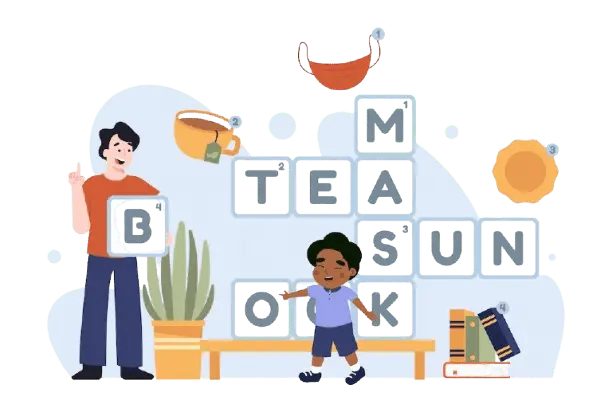

# Mini Crosswords App

A modern, interactive mini crossword puzzle application built with React and TypeScript. This project demonstrates clean architecture, component reusability, and a focus on user experience.



## Features

- Interactive crossword puzzle grid with responsive design
- Multiple puzzles with different difficulty levels
- Real-time validation of answers
- Keyboard input support for desktop users
- On-screen keyboard for mobile users
- Clues navigation for both across and down directions
- Celebration animation on puzzle completion
- Clean, modern UI built with Tailwind CSS and Radix UI

## Technology Stack

- **Frontend Framework**: React 19
- **Language**: TypeScript
- **Styling**: Tailwind CSS
- **UI Components**: Radix UI
- **Build Tool**: Vite
- **Package Manager**: npm

## Project Structure

```
src/
├── assets/         # Static assets like images
├── components/     # UI components
│   ├── layout/     # Layout components
│   └── ui/         # UI components
│       ├── button/
│       ├── card/
│       ├── crossword/  # Crossword specific components
│       ├── dialog/
│       ├── keyboard/
│       └── select/
├── data/           # Puzzle data
├── lib/            # Utility functions
├── pages/          # Page components
├── routers/        # Routing configuration
└── styles/         # Global styles
```

## Crossword Components

The crossword functionality is divided into several components for better separation of concerns:

- `CrosswordGrid`: Renders the crossword puzzle grid
- `CrosswordClues`: Displays the across and down clues
- `CrosswordKeyboard`: Provides an on-screen keyboard for input
- `CrosswordProvider`: Manages the state of the crossword puzzle
- `CrosswordConfetti`: Shows celebration animation on puzzle completion
- `CrosswordDialogSuccess`: Displays a success dialog when the puzzle is completed

## Getting Started

### Prerequisites

- Node.js (v16 or higher)
- npm (v7 or higher)

### Installation

1. Clone the repository

```bash
git clone https://github.com/yarmolem/crossword.git
cd crossword
```

2. Install dependencies

```bash
npm install
```

3. Start the development server

```bash
npm run dev
```

4. Open your browser and navigate to `http://localhost:5173`

## Building for Production

```bash
npm run build
```

This will generate a production-ready build in the `dist` directory.

## Project Highlights

- **Modular Architecture**: Components are designed to be reusable and maintainable
- **Responsive Design**: Works well on both desktop and mobile devices
- **Type Safety**: Full TypeScript implementation for better code quality
- **Modern UI**: Clean and intuitive user interface
- **Performance Optimized**: Fast loading and rendering

## Future Improvements

- Add more puzzles with varying difficulty levels
- Implement user accounts to track progress
- Support for theme customization
- Implement puzzle generation algorithm

## License

MIT
